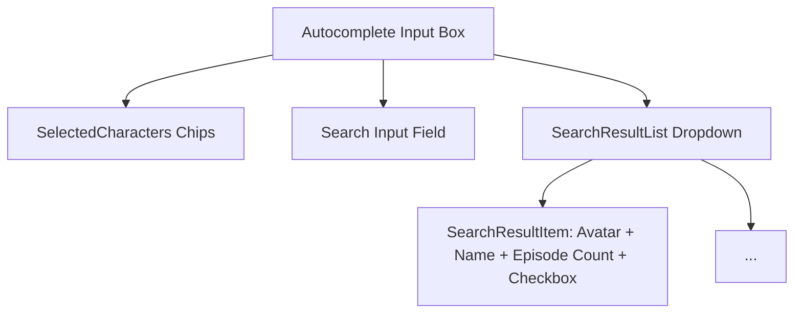

# 🧪 Rick and Morty - Accessible Multi-Select Autocomplete

[](https://www.typescriptlang.org/)
[](https://reactjs.org/)
[](https://rickandmortyapi.com/)
[](https://www.w3.org/WAI/ARIA/apg/)
[](https://www.yucelgumus.dev/)

> **Rick and Morty API** verilerini kullanarak karakterler arasında anlık arama yapan, seçilen karakterleri etiket (chip/tag) olarak yöneten, tam klavye navigasyonuna (keyboard accessibility) ve eşleşen harfleri vurgulama (text highlighting) özelliğine sahip **React & TypeScript** çoklu seçim bileşeni.

---

## 🌟 Öne Çıkan Özellikler

- ⌨️ **Kapsamlı Klavye Erişilebilirliği (Keyboard Navigation):** `Yukarı / Aşağı Ok` tuşlarıyla listede gezinme, `Enter` ile seçme, `Backspace` ile son seçilen etiketi silme ve `Escape` ile listeyi kapatma (`keyboardsEvents.ts`).
- 🔍 **Arama Terimi Vurgulama (Substring Highlighting):** Kullanıcının yazdığı arama ifadesini karakter isimleri içerisinde otomatik olarak kalın/renkli vurgular (`highlightCharacterName.tsx`).
- 🏷️ **Zengin Etiket Yönetimi (Multi-Select Chips):** Seçilen karakterleri avatar görseli, isim ve kaldırma (X) butonu ile input içinde zarif biçimde sergileme.
- ⚡ **Optimize Edilmiş API İletişimi:** Gereksiz ağ isteklerini önleyen debounced API çağrıları (`fetchData.ts`).
- 🛡️ **Sıkı TypeScript Tip Güvenliği:** API yanıtları ve bileşen durumları için eksiksiz tip tanımları (`Interface.ts`).

---

## 🏗️ Bileşen Hiyerarşisi



---

## 🚀 Hızlı Başlangıç

### Gereksinimler
- **Node.js**: v16.0 veya üstü

### Kurulum

```bash
git clone https://github.com/yucel-gumus/RickAndMorty_MultiSelect.git
cd RickAndMorty_MultiSelect

npm install
```

### Başlatma

```bash
npm start
```

Tarayıcınızda `http://localhost:3000` adresinde çalışacaktır.

---

## 📂 Proje Dizin Yapısı

```
RickAndMorty_MultiSelect/
├── package.json
├── tsconfig.json
├── public/
└── src/
    ├── index.tsx
    ├── App.tsx
    ├── component/
    │   ├── MyComponent.tsx         # Ana multi-select konteyneri
    │   ├── SelectedCharacters.tsx  # Seçili etiketler bileşeni
    │   ├── SearchResultList.tsx    # Arama sonuç listesi
    │   └── SearchResultItem.tsx    # Tekil karakter satırı
    ├── utils/
    │   ├── fetchData.ts            # Rick & Morty API istemcisi
    │   ├── keyboardsEvents.ts      # Klavye tuş dinleyicileri
    │   ├── highlightCharacterName.tsx # İsim vurgulayıcı
    │   └── Interface.ts            # TypeScript arayüzleri
    └── styles/
        └── style.tsx               # Özel CSS ve tema stilleri
```

---

## 📄 Lisans
Bu proje [MIT Lisansı](LICENSE) ile lisanslanmıştır.

---

## 👨‍💻 Geliştirici & İletişim

**Yücel Gümüş** - Full Stack Developer

- 🌐 **Web Sitesi / Portfolyo:** [yucelgumus.dev](https://www.yucelgumus.dev/)
- 💼 **LinkedIn:** [linkedin.com/in/yucel-gumus](https://www.linkedin.com/in/yucel-gumus/)
- 🐙 **GitHub:** [@yucel-gumus](https://github.com/yucel-gumus)

<p align="left">
  <a href="https://www.yucelgumus.dev/" target="_blank" rel="noopener noreferrer">
    
  </a>
</p>